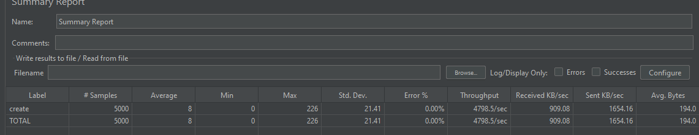

# 银行交易管理系统

## 项目简介

银行交易管理系统演示项目，基于Spring Boot框架开发，主要实现用户存取款记录的管理功能。采用DDD（领域驱动设计）架构模式，提供完整的增删改查操作。

## 🌐 访问地址

- **API文档**: http://localhost:8080/swagger-ui/index.html
- **前端页面**: http://localhost:8080

## 🎯 功能特性

- 页面包含增、删、改、查基本功能（暂无CSS样式）
- 统一异常处理，返回统一格式的错误信息
- 接口采用Ajax异步请求，已引入jQuery 3.7.1版本
- **注意**: 前端列表页面目前固定查询第1页，每页显示10条记录（待引入分页插件优化）

### 核心接口功能

| 接口名称 | 功能描述 |
|---------|---------|
| `createTransaction` | 创建一条交易记录 |
| `deleteTransaction` | 删除一条交易记录 |
| `updateTransaction` | 修改一条交易记录 |
| `page` | 分页查询交易记录 |

## 🏗️ 技术选型与架构设计

### 设计目标

1. **可扩展性** - 模块化设计，支持功能扩展
2. **高性能** - 多线程优化，缓存机制
3. **高可靠性** - 基于Spring Boot生态，后续可快速接入Spring Cloud实现分布式+集群部署

### 架构模块（DDD设计模式）

采用领域驱动设计（DDD）模式，核心分层结构如下：

```
📁 项目结构
├── controller/      # HTTP接口层 - 提供REST API
├── application/     # 应用服务层 - 对外接口抽象实现，服务定义
├── domain/         # 领域业务层 - 实现具体业务逻辑  
├── infrastructure/ # 基础设施层 - 数据模块、核心依赖、配置
├── common/         # 通用模块 - 工具类、常量等
└── config/         # 配置模块 - 系统配置
```

### 接口文档

采用Swagger技术，通过注解方式自动生成API文档，支持快速联调测试。

## ⚡ 性能优化策略

### 高性能设计

1. **多线程技术** - 提高CPU利用率
2. **精细化锁控制** - 对订单ID进行加锁，避免对整个账户加锁
3. **LRU缓存方案** - 对分页数据进行缓存，减少数据库查询次数，支持相同查询参数的缓存复用

> **备注**: 实际生产项目一般不会对分页数据做缓存，本项目中仅为演示用途

### 高可靠性保障

- 基于Spring Boot体系架构
- 后期可快速接入Spring Cloud相关技术栈
- 支持集群部署提升系统可靠性
- 当前为单机Demo版本，暂不考虑集群架构

## 🔧 技术栈

### 后端依赖

| 技术 | 版本 | 用途 |
|------|------|------|
| Spring Boot Web | - | 基础Web框架 |
| Lombok | - | 简化代码（自动生成setter/getter） |
| Jackson | - | JSON序列化处理 |
| SpringDoc OpenAPI | - | API文档自动生成 |

### 前端依赖

- **jQuery**: 3.7.1版本，主要用于异步请求后端接口

## 🧪 测试方案

### 测试考虑因素

1. **功能性测试** - 验证增删改查功能正常性
2. **安全性测试** - 当前版本暂无身份验证，接口安全性暂不考虑
3. **容量限制** - 数据存储在内存中，通过`bank.transaction.maxCount`配置限制最大交易记录数量，防止OOM
4. **性能测试** - 压力测试验证系统性能表现

### 功能测试

#### 单元测试
```bash
mvn test
```
- 主要测试用例位于`TransactionControllerTest`类中
- 覆盖增、删、改、查功能的REST接口测试

#### 页面功能测试
通过前端页面点击操作，验证功能正常性和页面显示效果

#### 自动化测试框架
支持构建自动化测试平台或编写自动化测试脚本：
- 接口自动化测试
- 页面自动化测试  
- 性能自动化测试

### 性能测试

#### 测试方案
1. **压测工具**: 可使用JMeter、Gatling等专业压测工具
2. **全链路性能测试**: 端到端性能验证

#### 测试环境配置
- **硬件环境**: 8核16G SSD硬盘
- **测试负载**: 500线程循环10次（共5000个请求）
- **测试工具**: JMeter（`jmx`目录下包含`createTransaction`接口压测脚本）
- **JVM配置**: `-Xms2048m -Xmx2048m -XX:+UseG1GC`
- **Tomcat设置**: 线程最大数采用默认200

#### 性能测试结果

| 性能指标 | 测试结果 |
|---------|---------|
| 平均响应时间 | ~8ms |
| 接口吞吐量 | ~4800/s |
| 错误率 | 0% |
| 系统资源 | JVM内存正常，线程数正常 |

> **说明**: 由于接口逻辑相对简单且数据保存在内存中，因此吞吐量较高，但实际生产环境中可能受到数据库、网络等因素影响。


#### 性能瓶颈影响因素
1. 内存因素： demo中交易数据保存在内存中（map），随着数据量增加，map的扩容和数据复制会影响性能
2. tomcat线程池：demo中的tomcat用的默认线程数为200，实际生产环境中可根据业务需求调整线程数
## 🚀 部署运维

### Docker容器化部署

本演示项目使用Docker进行容器化部署，支持以下部署流程：

```bash
# 1. 项目打包
mvn package

# 2. 构建Docker镜像
docker build -t bank-transaction-app:1.0 .

# 3. 运行容器
docker run -p 8080:8080 bank-transaction-app:1.0
```

### 生产环境运维建议

1. **持续集成**: 建议通过CI/CD流水线进行自动化部署
2. **健康检查**: 可引入Spring Boot Actuator，结合Prometheus或Grafana进行可视化监控（当前演示版本暂未引入）
3. **容器编排**: 采用Kubernetes进行容器编排，配置健康探针接口和容器资源限制
4. **服务治理**: 增强服务健壮性和可维护性
5. **监控告警**: 推荐使用Prometheus + Grafana监控方案

### 扩展性考虑

- 支持快速接入Spring Cloud技术栈
- 支持微服务架构改造
- 支持集群部署和负载均衡

## ⚠️ 注意事项

1. **数据持久化**: 当前版本数据存储在内存中，应用重启后数据将丢失
2. **安全认证**: 演示版本暂未实现身份验证机制
3. **容量限制**: 通过配置项控制最大记录数，防止内存溢出
4. **分页功能**: 前端分页功能有待完善

## 📝 后续优化计划

- [ ] 引入分页插件优化前端分页体验
- [ ] 添加CSS样式美化用户界面
- [ ] 集成持久化数据库（如MySQL、PostgreSQL）
- [ ] 实现用户认证和权限管理
- [ ] 交易订单号生成策略指定
- [ ] 集成Spring Boot Actuator监控

---

> **项目性质**: 技术演示项目，适用于学习和参考用途

